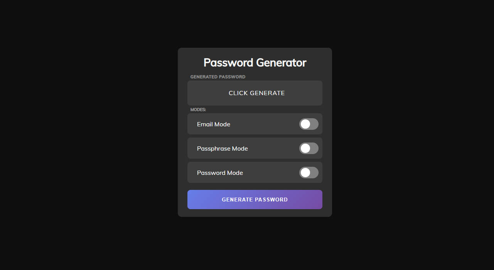

# passGenerator
 CREATE BY [**impulsado**](https://www.instagram.com/impulsado/)

<br/>

Password generator project for web environment. <br/>
As I couldn't find any website that could do the email mode, plus the other modes (normal and passphrase) I decided to create it myself.



<br/>

## [Website](https://impulsado2.github.io) 🔐🌐

<br/>

## Explanation of modes
### Email Mode
When we think of a secure password, an email does not come to mind, but let's review its advantages:
- Easy to remember.
- They are long enough without any added complexity.
- They contain symbols.
- The implementation of capital letters or numbers is very comfortable.

<br/>
These are some of its advantages, but the most important is: The added difficulty against Keyloggers. Normally, after your email, you write the password, but if the attacker reads that password after your email, it can be more camouflaged to the naked eye.

```Keylogger Log
> Normal mode
impulsado@protonmail.com [Tab] $PEmzwFWyCgn&FW6Rc*@QC#^qkExAx6&

> Email mode
impulsado@protonmail.com [Tab] Pablo.motos1@gmail.com
```

[//]: As long as we do not copy and paste the password or our username is not a mail.

<br/>

### Passphrase Mode
My everyday language is Spanish and I had not found any site that would generate passwords in passphrase mode with Spanish words. Some of the advantages of this mode are:
- They can be very long.
- They contain symbols.
- Easy to remember.
- Implementing capital letters and numbers is very simple.

<br/>

### Normal Mode
Clearly, the normal password mode should be to be complete. Although, personally, I do not recommend them, there are many people who still use them.

<br/>

## Password Manager
It is always highly recommended to use a secure password manager. Some of my recommendations are: 
- Bitwarden.
- KeePass.

<br/>

They are very different from each other, I recommend you to investigate and choose according to what fits you best.
Remember that I have a [homeLab](https://github.com/impulsado/homeLab) project where I explain how to host your own Bitwarden server at home.